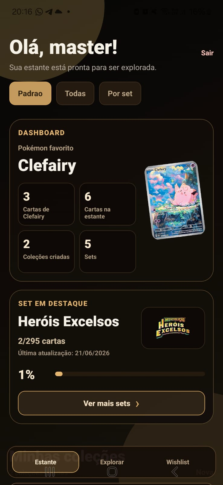
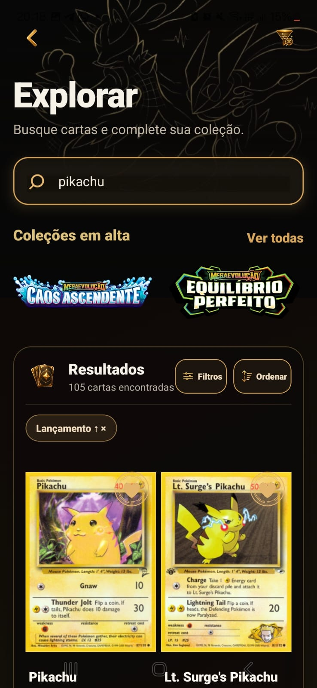
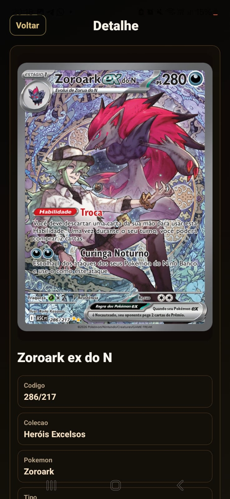

#  Estante do Treinador 

---

## 💛 Sobre o projeto

O **Estante do Treinador** é um aplicativo mobile criado para ajudar treinadores e colecionadores a organizarem suas cartas de forma simples, bonita e divertida.

A ideia é transformar a experiência de colecionar cartas em algo mais visual, prático e personalizado, permitindo visualizar sua coleção a qualquer momento.

---

## 🎯 O que você pode fazer no app

🃏 cadastrar cartas na estante • organizar coleção • explorar cartas  
⭐ montar coleções personalizadas • acompanhar progresso dos sets  
❤️ salvar cartas na wishlist  

---

## ⚠️ Aviso

> Projeto desenvolvido para fins acadêmicos e de portfólio.  
> Não possui vínculo com marcas oficiais.

---

<p align="center">
  
</p>

---

## 📱 Sobre o app

O app permite visualizar sua coleção com:

- imagens das cartas  
- raridades  
- sets completos  
- wishlist  
- detalhes completos  

Interface com tema escuro + dourado, trazendo sensação de coleção premium.

---

<p align="center">
  
</p>

---

## 💛 Funcionalidades

📚 Estante — organize suas cartas  
🔎 Explorar — pesquise cartas  
⭐ Wishlist — salve cartas desejadas  
🗂️ Coleções — crie coleções personalizadas  
🧩 Sets — progresso por coleção  
🖼️ Detalhes — informações completas  
📅 Captura — data de obtenção  

---

## 🖼️ Screenshots

<p align="center">
  
  
  
</p>

<p align="center">
  
  
</p>

---

## 🛠️ Tecnologias

- React Native  
- Expo  
- Expo Router  
- TypeScript  
- AsyncStorage  
- JSON Server  
- TCGDex API  

---

## 🚀 Como rodar

```bash
git clone https://github.com/GraziellaPereira/estante-do-treinador.git
cd meu-app
npm install
npx expo install
npx json-server --watch db.json --port 3000
npx expo start -c
```

---

## 📌 Status

🚧 Em desenvolvimento

✔ Funcional:
- login
- estante
- explorar
- wishlist
- coleções
- detalhes
- progresso por set
- data de captura

---

## 🚀 Melhorias futuras

- scanner de cartas  
- feed de fotos  
- estatísticas avançadas  
- sincronização online  
- gamificação  

---

## 👩‍💻 Desenvolvido por

**Graziella Pereira**

---

## 💛 Final

A Estante do Treinador transforma coleção em experiência.

<p align="center">
  
</p>
