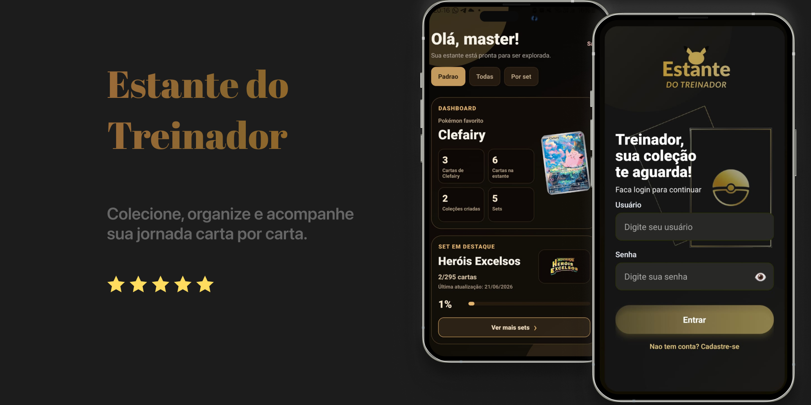

# Estante do Treinador

##   Olá treinador!

Bem-vindo(a) à **Estante do Treinador**! Sua estante portátil de cartinhas de Pokémon 🃏✨

Este é um aplicativo mobile criado para ajudar treinadores e colecionadores a organizarem suas cartas de forma simples, bonita e divertida.

A ideia do projeto é transformar a experiência de colecionar cartas em algo mais visual, prático e personalizado, já que nem sempre conseguimos visualizar a nossa coleção física a qualquer momento.

Com o app, o usuário pode:

- cadastrar cartas na sua estante  
- organizar sua coleção do jeito que preferir  
- explorar novas cartas  
- montar coleções personalizadas  
- acompanhar o progresso dos sets  
- salvar cartas na wishlist  

---

📌 Projeto desenvolvido para fins acadêmicos e de portfólio.  
Este projeto não é oficial e não possui vínculo com marcas ou empresas detentoras dos direitos das cartas.

---

## 📱 Sobre o projeto

O **Estante do Treinador** nasceu com a proposta de ser uma estante digital para cartas colecionáveis.

Em vez de anotar cartas em planilhas, deixar elas paradas em seu fichário ou depender apenas da memória, o usuário consegue visualizar sua coleção de forma organizada, com imagens, raridades, sets, wishlist e informações detalhadas de cada carta.

O app possui uma interface em tema escuro com detalhes dourados, buscando transmitir uma sensação de coleção premium, moderna e aconchegante.

---

## 💛 Funcionalidades

📚 **Estante de cartas**  
Cadastre cartas que você já possui na sua coleção.

🔎 **Explorar cartas**  
Pesquise cartas por nome, código, coleção, tipo ou raridade.

⭐ **Wishlist**  
Salve cartas que você ainda deseja conquistar.

🗂️ **Coleções personalizadas**  
Crie coleções próprias e organize suas cartas do seu jeito.

🧩 **Progresso por set**  
Acompanhe quantas cartas você possui de cada set.

🖼️ **Detalhes da carta**  
Visualize informações completas da carta, incluindo imagem, raridade e artista.

📅 **Data de captura**  
Registre quando você conquistou cada carta.

---

## 🛠️ Tecnologias utilizadas

Este projeto foi desenvolvido com:

- React Native  
- Expo  
- Expo Router  
- TypeScript  
- AsyncStorage  
- JSON Server  
- API de código aberto de cartas de pokémon TCG - TCGDex

---

## 🚀 Como rodar o projeto

### 📌 Pré-requisitos

- Node.js  
- npm  
- Expo CLI  
- Emulador Android/iOS ou app Expo Go  

---

### 1. Clone o repositório

git clone <url-do-repositorio>

Entre na pasta do projeto:

cd meu-app

---

### 2. Instale as dependências

npm install

Se estiver usando Expo:

npx expo install

---

### 3. Inicie a API local

O projeto utiliza JSON Server como backend fake.

npx json-server --watch db.json --port 3000

A API ficará disponível em:

http://localhost:3000

Se estiver no celular, troque localhost pelo IP da sua máquina.

---

### 4. Inicie o app

npx expo start -c

Depois:

- pressione **a** → Android  
- pressione **i** → iOS  
- escaneie o QR Code com Expo Go  

---

## 🧭 Como usar o app

### 🔐 Login
Crie ou entre na sua conta para acessar sua estante personalizada.

---

### 📚 Adicionar cartas

1. Vá até Estante  
2. Clique em Adicionar carta  
3. Digite o código (ex: 002/131)  
4. Busque a carta  
5. Selecione a data de captura  
6. Salve  

---

### 🔎 Explorar cartas

- Pesquise por nome, código ou coleção  
- Use filtros de raridade e tipo  
- Clique na carta para ver detalhes  
- Adicione à wishlist clicando no coração  

---

### ⭐ Wishlist

- Veja cartas desejadas  
- Remova quando quiser  
- Acompanhe o progresso da coleção  

---

### 🗂️ Coleções

- Crie coleções personalizadas  
- Organize suas cartas  
- Capa automática com 3 primeiras cartas  
- Personalização opcional da capa  

---

## 📌 Status do projeto

Em desenvolvimento

Funcionalidades já implementadas:
- Login  
- Estante de cartas  
- Explorar cartas  
- Wishlist  
- Coleções personalizadas  
- Progresso por set  
- Detalhes da carta  
- Data de captura  

---

## 🚀 Melhorias futuras

- Scanner de cartas  
- Feed de fotos  
- Estatísticas avançadas  
- Sincronização online  
- Performance e cache
- Gamificação da coleção  

---

## 👩‍💻 Desenvolvido por

Projeto criado por Graziella Pereira 💜  
Estudo de React Native + APIs + TypeScript  

---

## 💛 Final

A Estante do Treinador transforma sua coleção em uma experiência visual, organizada e divertida.

Cada carta é uma conquista!

  

